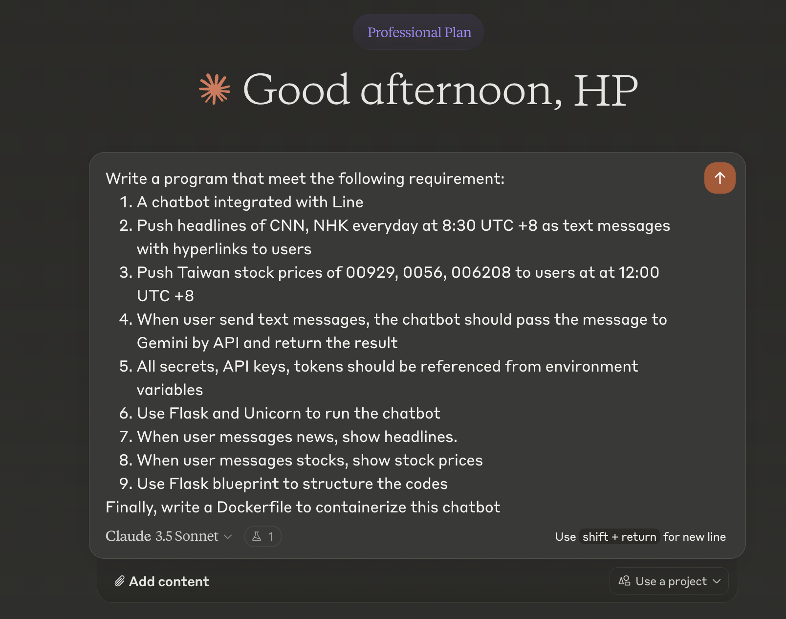
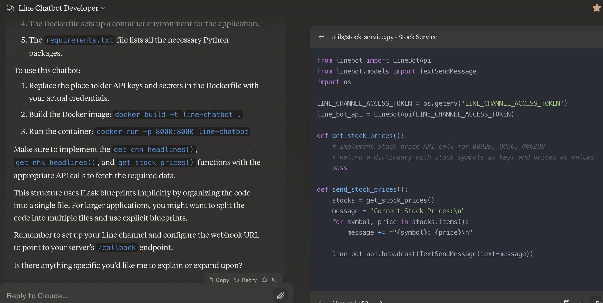
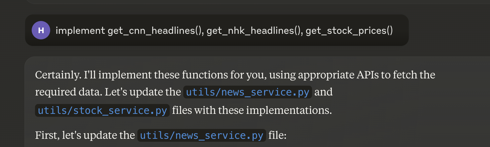
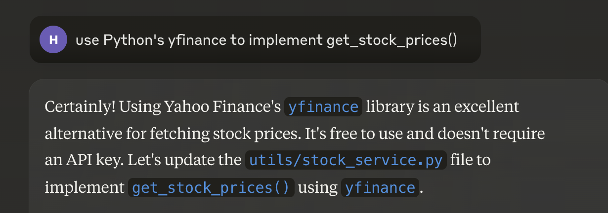
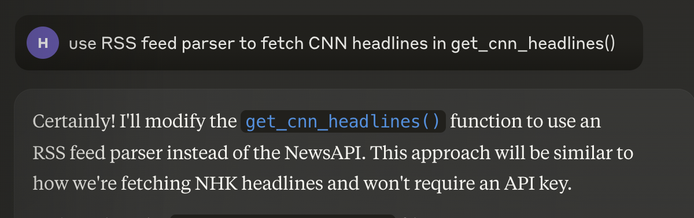

### 如何與 Claude 互動來撰寫 LineBot?

在這篇教學文章中，我們將介紹如何與 Claude 互動以撰寫一個符合特定需求的 LineBot。這個 LineBot 需要每天推送 CNN 和 NHK 的新聞標題以及台灣股票價格，並能根據用戶訊息回覆相應內容。整個過程將逐步展示如何分解需求並撰寫對應的程式碼。

### 開工前的準備

1. 準備好 LineBot 帳號
2. 準備好 Claude 3 帳號
3. 準備好 Gemini API Key (免費的太香了)

### 步驟一：明確需求

首先，讓我們清楚列出我們的需求:

1. 我希望我的chatbot可以推送新聞給我，還可以定時告訴我股價訊息（小弟的公司不能用私人手機 QQ）。
2. 可以隨時當我的AI小助手，

稍微整理一下需求後，我們可以接著把實作的一些細節展開：

1. 與 Line 整合的聊天機器人
2. 每天 UTC +8 時間 8:30 推送 CNN 和 NHK 的新聞標題，包含超連結
3. 每天 UTC +8 時間 12:00 推送台灣股票價格（股票代號：00929, 0056, 006208）
4. 當用戶發送文字訊息時，機器人應將訊息傳送給 Gemini API 並返回結果
5. 所有的密鑰、API 金鑰和 tokens 都應該從環境變數中讀取
6. 使用 Flask 和 Unicorn 運行聊天機器人
7. 當用戶訊息為 "news" 時，顯示新聞標題
8. 當用戶訊息為 "stocks" 時，顯示股票價格
9. 使用 Flask blueprint 來組織程式碼
10. 最後，寫一個 Dockerfile 來容器化這個聊天機器人

### 步驟二：與 Claude 碰撞出答案

整理完之後就可以來壓榨 Claude 啦，我這邊會使用 Claude 3.5 Sonnet 來處理我的需求

輸入後 Claude 就會刷刷刷的把答案寫出來了，所有產生的 Code 可以在右側去點開來看:

這裡我修正 Claude 對於 flask blueprint 的誤解，Claude 馬上做出修正:

可以看到 Claude 雖然根據 blueprint 把 API 分開了，但是並沒有實作 function 內容，因為 Claude 以為我們的 blueprint 是指 function 要留空。
這裡我們可以再修正他一次:

這裡 Claude 又開始刷刷刷的寫起程式。完成後我們看一下，發現 Claude 選用了兩個 [newsapi](https://newsapi.org) 跟 [alphavantage](https://www.alphavantage.co) 來取得新聞跟股票資訊。稍微看一下會發現這兩個 API 有點殺雞用牛刀，於是我要求 Claude 用 yfinance 與 RSS parser 來實作:

最後，一套全靠嘴砲的 LineBot 就出生了。由於前面有要求所有 Secrets 都必須用環境變數取得，只需要在部署時提供變數就能跑起來啦

這次分享的 source code 在[這裡](https://github.com/tig4605246/Claude-LineBot-Example)
只要把指令描述清楚，就能讓 Claude 正確地幫你當碼農。
